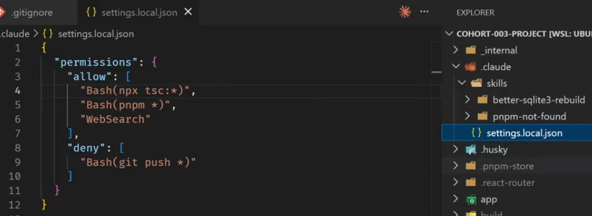

/usage ==> shows the total usage
/context ==> see current context visually
/clear  ==> clear current context

- in the middle of claude thinking, you could press `esc` to pause
the thinking process and type `GO` to continue the thinking process.

- to target specific file: use `@ `

- stash current command in terminal: ctrl + s

- integrate claude code to your IDE: /ide

- to restore the code or conversation: two times press `esc` button

- claude persists its sessions locally. to resume latest session:

 or just create new session and type: `/resume` and you can select each of previous sessions you had.

 and also if you pressed `ctrl + c` to stop the current session, you can try `claude --continue` to resume the last session.

 - to make the claude code to see you running command and all of its logs and errors in terminal, run `! <your command>`
 and you can use `ctrl + B` to bring that running command to background.

 - if you want to run a command in the middle of your claude session but do'nt want claude see the command, you can suspend that session by using `crtl + z` and to return back to that session use `fg`

 - set permissions for claude:
 

 

